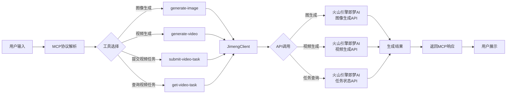

# 即梦AI多模态MCP

这是一个基于火山引擎即梦AI的多模态生成服务，支持图像生成、视频生成等功能，可通过MCP协议在Cursor、Claude Desktop等MCP客户端中使用，也可作为独立库调用。支持 macOS、Linux、Windows 及 WSL 环境。

## 版本更新

### v1.0.14
- 增强MCP工具定义，确保所有工具在客户端可见
- 优化异步参数处理，默认启用异步模式避免超时
- 增加更详细的视频生成调试信息

### v1.0.9-beta.1
- 测试版：增强MCP工具定义，确保所有工具在客户端可见
- 优化异步参数处理，默认启用异步模式避免超时
- 增加更详细的视频生成调试信息
- 修复工具参数传递问题

### v1.0.5
- 优化文档结构，为不同平台提供清晰配置说明
- 增加 PowerShell 配置示例
- 提供各平台永久环境变量设置方法
- 添加多平台配置注意事项

### v1.0.4
- 优化服务启动和响应返回，现在所有响应均使用标准JSON格式
- 统一错误处理和成功响应的数据结构
- 增强错误信息的可读性和可解析性

## 核心功能

- ✅ **文生图** - 通过文本描述生成高质量图像 (模型: jimeng_t2i_s20pro)
- ✅ **文生视频** - 将文本描述转换为流畅视频 (模型: jimeng_vgfm_t2v_l20)
- ✅ **图生视频** - 将静态图像转换为动态视频 (模型: jimeng_vgfm_i2v_l20)
- ✅ **多平台支持** - 支持 macOS、Linux、Windows 及 WSL 环境
- 🛠️ 完整TypeScript类型定义和错误处理
- 🔄 支持异步任务处理和状态追踪
- 🎛️ 自定义参数控制 (尺寸、比例、帧数等)

## 系统架构

以下流程图展示了即梦AI多模态MCP的工作流程和系统架构：



## 可用MCP工具

| 工具名称 | 描述 | 主要参数 |
|---------|------|---------|
| `generate-image` | 生成图像 | text, illustration, color, ratio |
| `generate-video` | 生成视频 | prompt, async, intent_sync |
| `submit-video-task` | 提交视频生成任务 | prompt |
| `get-video-task` | 获取视频任务结果 | task_id |

## 快速开始

### 安装

所有平台（macOS/Linux/Windows）：

```bash
# NPM全局安装
npm install -g jimeng-ai-mcp

# 或本地安装
git clone https://github.com/freeleepm/jimeng-ai-mcp.git
cd jimeng-mcp
npm install
npm run build
```

### 环境变量配置

在使用前，需设置火山引擎即梦AI服务的访问密钥：

#### macOS/Linux

```bash
# 设置环境变量
export JIMENG_ACCESS_KEY=你的火山引擎访问密钥
export JIMENG_SECRET_KEY=你的火山引擎密钥

# 或创建.env文件
echo "JIMENG_ACCESS_KEY=你的火山引擎访问密钥" > .env
echo "JIMENG_SECRET_KEY=你的火山引擎密钥" >> .env

# 永久设置环境变量（添加到 .bashrc 或 .zshrc）
echo 'export JIMENG_ACCESS_KEY="你的火山引擎访问密钥"' >> ~/.bashrc
echo 'export JIMENG_SECRET_KEY="你的火山引擎密钥"' >> ~/.bashrc
source ~/.bashrc
```

#### WSL (Windows Subsystem for Linux)

```bash
# 设置环境变量
export JIMENG_ACCESS_KEY=你的火山引擎访问密钥
export JIMENG_SECRET_KEY=你的火山引擎密钥

# 或创建.env文件
echo "JIMENG_ACCESS_KEY=你的火山引擎访问密钥" > .env
echo "JIMENG_SECRET_KEY=你的火山引擎密钥" >> .env

# 永久设置环境变量（添加到 .bashrc）
echo 'export JIMENG_ACCESS_KEY="你的火山引擎访问密钥"' >> ~/.bashrc
echo 'export JIMENG_SECRET_KEY="你的火山引擎密钥"' >> ~/.bashrc
source ~/.bashrc
```

#### Windows

命令提示符 (CMD):
```cmd
:: 临时设置环境变量（当前会话有效）
set JIMENG_ACCESS_KEY=你的火山引擎访问密钥
set JIMENG_SECRET_KEY=你的火山引擎密钥

:: 创建.env文件
echo JIMENG_ACCESS_KEY=你的火山引擎访问密钥 > .env
echo JIMENG_SECRET_KEY=你的火山引擎密钥 >> .env

:: 永久设置环境变量（管理员命令提示符）
setx JIMENG_ACCESS_KEY "你的火山引擎访问密钥"
setx JIMENG_SECRET_KEY "你的火山引擎密钥"
```

PowerShell:
```powershell
# 临时设置环境变量（当前会话有效）
$env:JIMENG_ACCESS_KEY = "你的火山引擎访问密钥"
$env:JIMENG_SECRET_KEY = "你的火山引擎密钥"

# 创建.env文件
"JIMENG_ACCESS_KEY=你的火山引擎访问密钥" | Out-File -FilePath .env -Encoding ASCII
"JIMENG_SECRET_KEY=你的火山引擎密钥" | Out-File -FilePath .env -Encoding ASCII -Append

# 永久设置环境变量（管理员PowerShell）
[Environment]::SetEnvironmentVariable("JIMENG_ACCESS_KEY", "你的火山引擎访问密钥", "User")
[Environment]::SetEnvironmentVariable("JIMENG_SECRET_KEY", "你的火山引擎密钥", "User")
```

## 发布与版本管理

项目包含一个 `publish.sh` 脚本，用于简化版本发布和管理的流程。

### 使用方法

在项目根目录下运行脚本：

```bash
./publish.sh
```

脚本会提供一个菜单，引导你完成不同操作。

### 功能选项

1.  **发布新版本 (选项 1-5)**:
    *   **patch**: 用于修复错误 (例如 `1.0.4` -> `1.0.5`)。
    *   **minor**: 用于添加向后兼容的功能 (例如 `1.0.4` -> `1.1.0`)。
    *   **major**: 用于不向后兼容的重大更改 (例如 `1.0.4` -> `2.0.0`)。
    *   **beta**: 创建或递增一个测试版本 (例如 `1.0.4` -> `1.0.5-beta.0` 或 `1.0.5-beta.0` -> `1.0.5-beta.1`)。
    *   **自定义版本**: 手动输入一个新版本号。

    选择这些选项后，脚本会自动：
    *   检查未提交的 Git 更改。
    *   更新 `package.json`、`mcp.json`、`examples/mcp-server.ts` 和 `README.md` 中的版本号。
    *   构建项目。
    *   发布到 npm（beta 版本会使用 `beta` 标签）。
    *   提交版本更新并创建 Git 标签。

2.  **取消发布版本 (选项 6)**:
    *   这是一个**危险操作**，请谨慎使用。
    *   脚本会要求你输入需要取消发布的版本号，支持**输入多个版本号**（用空格隔开）。
    *   在执行 `npm unpublish` 前，会要求二次确认。
    *   **注意**: npm 策略通常只允许在发布后的72小时内取消发布。

## MCP客户端配置

### Cursor配置

#### macOS/Linux

在Cursor配置目录中创建`mcp-config.json`文件：

```json
{
  "mcpServers": {
    "jimeng": {
      "type": "stdio",
      "command": "npx",
      "args": [
        "-y",
        "jimeng-ai-mcp"
      ],
      "env": {
        "JIMENG_ACCESS_KEY": "你的火山引擎访问密钥",
        "JIMENG_SECRET_KEY": "你的火山引擎密钥"
      }
    }
  }
}
```

#### Windows

在Cursor配置目录中创建`mcp-config.json`文件：

```json
{
  "mcpServers": {
    "jimeng": {
      "type": "stdio",
      "command": "npx",
      "args": [
        "-y",
        "jimeng-ai-mcp"
      ],
      "env": {
        "JIMENG_ACCESS_KEY": "你的火山引擎访问密钥",
        "JIMENG_SECRET_KEY": "你的火山引擎密钥"
      }
    }
  }
}
```

#### WSL (Windows Subsystem for Linux)

在Cursor配置目录中创建`mcp-config.json`文件：

```json
{
  "mcpServers": {
    "jimeng": {
      "type": "stdio",
      "command": "cmd",
      "args": [
        "/c",
        "npx",
        "-y",
        "jimeng-ai-mcp"
      ],
      "env": {
        "JIMENG_ACCESS_KEY": "你的火山引擎访问密钥",
        "JIMENG_SECRET_KEY": "你的火山引擎密钥"
      }
    }
  }
}
```

> 注意：WSL环境下需要使用`cmd /c`前缀来确保命令正确执行。

### Claude Desktop配置

#### macOS/Linux

在Claude Desktop的配置文件`claude_desktop_config.json`中添加：

```json
{
  "mcpServers": {
    "jimeng": {
      "command": "npx",
      "args": [
        "-y",
        "jimeng-ai-mcp"
      ],
      "env": {
        "JIMENG_ACCESS_KEY": "你的火山引擎访问密钥",
        "JIMENG_SECRET_KEY": "你的火山引擎密钥"
      }
    }
  }
}
```

#### Windows

在Claude Desktop的配置文件`claude_desktop_config.json`中添加：

```json
{
  "mcpServers": {
    "jimeng": {
      "command": "npx",
      "args": [
        "-y",
        "jimeng-ai-mcp"
      ],
      "env": {
        "JIMENG_ACCESS_KEY": "你的火山引擎访问密钥",
        "JIMENG_SECRET_KEY": "你的火山引擎密钥"
      }
    }
  }
}
```

#### WSL (Windows Subsystem for Linux)

在Claude Desktop的配置文件`claude_desktop_config.json`中添加：

```json
{
  "mcpServers": {
    "jimeng": {
      "command": "cmd",
      "args": [
        "/c",
        "npx",
        "-y",
        "jimeng-ai-mcp"
      ],
      "env": {
        "JIMENG_ACCESS_KEY": "你的火山引擎访问密钥",
        "JIMENG_SECRET_KEY": "你的火山引擎密钥"
      }
    }
  }
}
```

### 配置注意事项

- **macOS/Linux**: 确保使用正确的环境变量和路径。
- **Windows**: 
  - 如果遇到路径问题，请检查命令路径是否正确，必要时使用完整路径。
  - 如果使用全局安装，可将 `npx -y jimeng-ai-mcp` 改为 `jimeng-ai-mcp` 命令。
- **WSL (Windows Subsystem for Linux)**: 
  - 在 WSL 环境中，必须使用 `cmd /c` 前缀来确保命令正确执行。
  - 请确保 Windows 端已正确安装 Node.js 和 npm。

## 工具使用示例

在支持 MCP 的客户端（如 Cursor、Claude Desktop）中，可以使用以下方式调用即梦AI工具：

### 生成图像示例

```
请使用generate-image工具生成一张图片，图片上显示"创新未来"文字，配饰元素包括科技、星空、光线，背景色调为蓝色，比例为16:9。
```

### 生成视频示例

```
请使用generate-video工具生成一段视频，视频内容为"熊猫在竹林中玩耍，阳光明媚，高清写实风格"。
```

### 异步视频任务示例

```
请使用submit-video-task工具提交一个视频生成任务，视频内容为"一只白色的小猪在沙滩上跑动"。提交后使用get-video-task工具查询结果。
```

## 常见问题与故障排除

### 1. 无法通过 npx 安装或运行

如果遇到 `npx jimeng-ai-mcp` 无法找到包的问题，请尝试：

- 确认网络连接正常，能够访问 npm 仓库
- 使用 `npm install -g jimeng-ai-mcp` 先全局安装，再使用 `jimeng-ai-mcp` 命令
- 检查 Node.js 版本是否满足要求 (需要 v14.0.0 或更高版本)

### 2. 环境变量问题

- 确保已正确设置 `JIMENG_ACCESS_KEY` 和 `JIMENG_SECRET_KEY` 环境变量
- 在 MCP 客户端配置文件中也需要配置这些环境变量
- 可以通过创建 .env 文件设置环境变量（项目提供了 .env.example 作为参考，确保文件位于工作目录）

### 3. 多平台兼容性

- Windows 用户可能需要调整路径分隔符（使用 `\\` 或 `/`）
- WSL 用户需要使用 `cmd /c` 前缀
- 确保 npm 包已正确安装在当前系统环境中

## 贡献与开发

欢迎为项目贡献代码或提出改进建议！以下是开发流程：

1. Fork 项目仓库
2. 创建功能分支 (`git checkout -b feature/amazing-feature`)
3. 提交更改 (`git commit -m 'Add some amazing feature'`)
4. 推送到分支 (`git push origin feature/amazing-feature`)
5. 创建 Pull Request

### 开发环境设置

```bash
# 克隆仓库
git clone https://github.com/freeleepm/jimeng-ai-mcp.git
cd jimeng-ai-mcp

# 安装依赖
npm install

# 启动开发服务器
npm run dev

# 构建生产版本
npm run build

# 发布到npm（需要npm账户权限）
npm version patch  # 更新版本号
npm publish
```

## MCP工具使用

### generate-image

生成图像的工具，根据文字提示生成图像。

**参数**：
- `text`: 要在图片上显示的文字
- `illustration`: 作为图片配饰的插画元素关键词
- `color`: 图片的背景主色调
- `ratio`: 图片比例，支持: 4:3 (512×384), 3:4 (384×512), 16:9 (512×288), 9:16 (288×512)

**示例**：
```
请使用generate-image工具生成一张图片，图片上显示"创新未来"文字，配饰元素包括科技、星空、光线，背景色调为蓝色，比例为16:9。
```

### generate-video

生成视频的工具，使用即梦AI文生视频模型。

**参数**：
- `prompt`: 视频内容的描述
- `num_frames`: 视频帧数 (可选，默认16)
- `fps`: 视频帧率 (可选，默认8)

**示例**：
```
请使用generate-video工具生成一段视频，视频内容为"熊猫在竹林中玩耍"，帧数为16。
```

### generate-image-to-video

图生视频工具，将静态图片转换为动态视频。

**参数**：
- `image_urls`: 输入图片URL数组 (JPEG/PNG格式)
- `prompt`: 动画效果描述 (可选)
- `aspect_ratio`: 视频比例 (可选，如"16:9"、"4:3"等，默认"16:9")
- `num_frames`: 视频帧数 (可选，默认16)
- `fps`: 视频帧率 (可选，默认8)

**示例**：
```
请使用generate-image-to-video工具生成视频，输入图片为https://example.com/image.jpg，效果为"波浪摇曳"，比例为"16:9"。
```

## 作为客户端库使用

### 基本用法

```typescript
import { JimengClient } from 'jimeng-ai-mcp';

// 创建客户端实例
const client = new JimengClient({
  accessKey: 'YOUR_ACCESS_KEY',
  secretKey: 'YOUR_SECRET_KEY',
  region: 'cn-beijing', // 默认区域
  debug: false // 设置为true可以查看详细日志
});

// 文生图示例
async function generateImage() {
  const result = await client.generateImage({
    prompt: "一只可爱的猫咪在草地上玩耍",
    width: 512,
    height: 512
  });
  
  if (result.success && result.image_urls && result.image_urls.length > 0) {
    console.log('图像URL:', result.image_urls[0]);
  } else {
    console.error('生成失败:', result.error);
  }
}

// 文生视频示例
async function generateVideo() {
  const result = await client.generateVideo({
    prompt: "一只可爱的猫咪在草地上玩耍"
  });
  
  if (result.success && result.video_urls && result.video_urls.length > 0) {
    console.log('视频URL:', result.video_urls[0]);
  } else {
    console.error('生成失败:', result.error);
  }
}

// 图生视频示例
async function generateImageToVideo() {
  const result = await client.generateImageToVideo({
    image_urls: ["https://example.com/image.jpg"],
    prompt: "波浪效果",
    aspect_ratio: "16:9"
  });
  
  if (result.success && result.video_urls && result.video_urls.length > 0) {
    console.log('视频URL:', result.video_urls[0]);
  } else {
    console.error('生成失败:', result.error);
  }
}
```

### 高级用法：异步任务处理

对于耗时较长的视频生成任务，可以使用异步方式：

```typescript
// 文生视频异步方式
async function generateVideoAsync() {
  // 提交任务
  const taskResult = await client.submitVideoTask({
    prompt: "一只可爱的猫咪在草地上玩耍",
    req_key: "jimeng_vgfm_t2v_l20"
  });
  
  console.log('任务ID:', taskResult.task_id);
  
  // 轮询任务结果
  let result;
  do {
    // 等待60秒再查询（符合API限制）
    await new Promise(resolve => setTimeout(resolve, 60000));
    
    // 查询任务结果
    result = await client.getVideoTaskResult(taskResult.task_id);
    console.log('任务状态:', result.status);
    
  } while (result.status === 'PENDING' || result.status === 'RUNNING');
  
  if (result.success && result.status === 'SUCCEEDED') {
    console.log('视频URL:', result.video_urls);
  } else {
    console.error('生成失败:', result.error);
  }
}

// 图生视频异步方式
async function generateImageToVideoAsync() {
  // 提交任务
  const taskResult = await client.submitI2VTask({
    image_urls: ["https://example.com/image.jpg"],
    prompt: "波浪效果",
    req_key: "jimeng_vgfm_i2v_l20"
  });
  
  console.log('任务ID:', taskResult.task_id);
  
  // 查询任务结果（简化示例，实际应用需要轮询）
  const result = await client.getVideoTaskResult(taskResult.task_id, "jimeng_vgfm_i2v_l20");
  
  if (result.success && result.status === 'SUCCEEDED') {
    console.log('视频URL:', result.video_urls);
  }
}
```

## Docker部署

创建以下Dockerfile：

```dockerfile
FROM node:16-alpine

RUN npm install -g jimeng-ai-mcp

ENV JIMENG_ACCESS_KEY=你的火山引擎访问密钥
ENV JIMENG_SECRET_KEY=你的火山引擎密钥

CMD ["jimeng-ai-mcp"]
```

构建并运行：

```bash
docker build -t jimeng-ai-mcp .
docker run -i --rm jimeng-ai-mcp
```

## 开发指南

### 本地开发

```bash
# 开发模式启动
npm run dev

# 构建
npm run build

# 测试
npm test

# 运行
npm start
```

### 发布NPM包

```bash
# 更新版本号
npm version patch|minor|major

# 构建项目
npm run build

# 发布
npm publish
```

## 故障排除

### 常见问题

1. **认证失败**：检查JIMENG_ACCESS_KEY和JIMENG_SECRET_KEY是否正确。

2. **图像格式不支持**：确保使用JPEG/PNG格式的图片，且URL可公开访问。

3. **QPS限制**：API有QPS=1的限制，多次调用时需间隔60秒。

4. **内容安全检查**：确保生成内容符合平台内容政策。

### 错误码列表

- `ERR_AUTH_FAILED`: 认证失败，检查访问密钥
- `ERR_TASK_FAILED`: 任务失败，查看详细错误信息
- `ERR_INVALID_PARAM`: 参数无效，检查输入参数
- `ERR_NETWORK`: 网络错误，检查网络连接
- `ERR_SERVER`: 服务器错误，稍后重试

## 贡献与支持

欢迎提交问题和拉取请求！如有问题，请通过GitHub Issues反馈。

## 许可证

MIT 

## 功能详解

### 图像生成 (generate-image)

使用`generate-image`工具可以根据文字描述、插图元素和颜色生成图像：

```json
{
  "text": "创新未来",
  "illustration": "科技、星空、光线",
  "color": "蓝色",
  "ratio": "16:9"
}
```

支持的图片比例：
- `4:3` - 512×384像素
- `3:4` - 384×512像素
- `16:9` - 512×288像素
- `9:16` - 288×512像素

### 视频生成 (generate-video)

`generate-video`工具支持根据文字描述生成视频。**从v1.0.5版本开始，该工具默认采用异步方式**，即立即返回任务ID，然后需要使用`get-video-task`工具查询结果。

#### 参数说明

- `prompt` - 视频内容描述（必填）
- `async` - 是否使用异步方式（可选，默认为`true`）
- `intent_sync` - 是否检测到同步生成意图（可选，默认为`false`）

#### 行为模式

1. **异步模式**（默认）：
   - 立即返回任务ID，不等待视频生成完成
   - 需要后续使用`get-video-task`工具查询结果
   - 适合生产环境和避免超时的场景

   ```json
   {
     "prompt": "一只熊猫在竹林中玩耍"
   }
   ```

2. **同步模式**：
   - 等待视频生成完成后返回结果（可能需要1-2分钟）
   - 有可能因为生成时间过长导致请求超时
   - 适合测试和快速体验

   触发同步模式的方式：
   - 显式设置`async=false`
   - 设置`intent_sync=true`
   - 在提示中包含表示期望即时结果的关键词（如"一次输出"、"同步输出"、"等待结果"等）

   ```json
   {
     "prompt": "一只熊猫在竹林中玩耍",
     "async": false
   }
   ```

   或通过意图表达（大模型会自动识别并设置`intent_sync=true`）：
   
   ```
   请帮我生成一个熊猫在竹林中玩耍的视频，希望一次输出结果
   ```

#### 最佳实践

- 对于生产环境或AI助手集成，建议使用默认的异步模式
- 视频生成通常需要1-2分钟，异步模式可避免超时错误
- 如果需要同步结果，确保设置足够长的请求超时时间

### 分步式视频生成

对于需要更精细控制的场景，可以使用分步式视频生成：

1. 提交视频生成任务：

```json
// submit-video-task
{
  "prompt": "一只白色的小猪在沙滩上跑动"
}
```

2. 使用返回的任务ID查询结果：

```json
// get-video-task
{
  "task_id": "12345678901234567890"
}
``` 